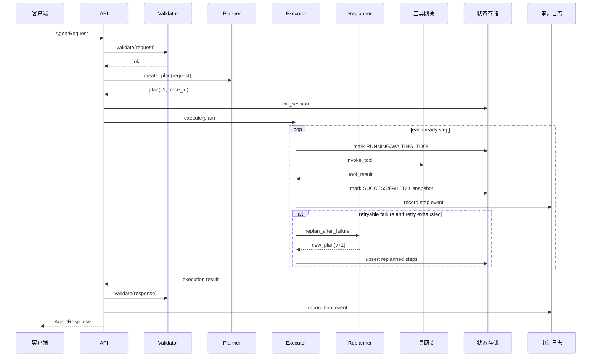

# 主流程时序

## 请求路径
1. API 接收 AgentRequest。
2. Validator 校验请求契约。
3. Planner 构建结构化计划（带 trace_id 与 plan_version）。
4. Executor 按依赖调度步骤（串并混合）。
5. Gateway 执行工具并返回统一结果封装。
6. 失败步骤按策略触发 Replanner（可选）。
7. State Store 持久化步骤状态、幂等键、快照。
8. API 组装 AgentResponse 并写入审计日志。

## Mermaid 时序图

