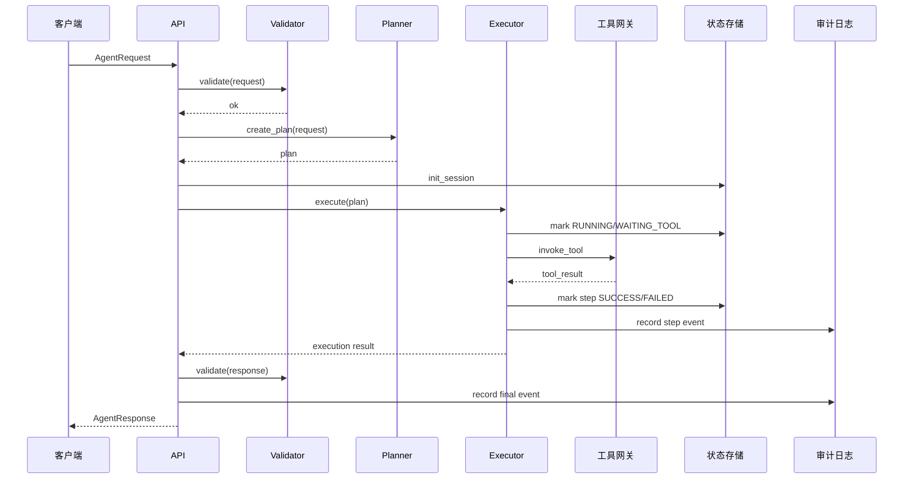

# 主流程时序

## 请求路径
1. API 接收 AgentRequest。
2. Validator 校验请求契约。
3. Planner 构建有序计划步骤。
4. Executor 通过 gateway 执行工具。
5. 状态存储持久化步骤状态与快照。
6. 响应组装器返回 AgentResponse。
7. 审计日志记录最终结果。

## Mermaid 时序图

```mermaid
sequenceDiagram
    participant C as 客户端
    participant A as API
    participant V as Validator
    participant P as Planner
    participant E as Executor
    participant G as 工具网关
    participant S as 状态存储
    participant L as 审计日志

    C->>A: AgentRequest
    A->>V: validate(request)
    V-->>A: ok
    A->>P: create_plan(request)
    P-->>A: plan
    A->>S: init_session
    A->>E: execute(plan)
    E->>S: mark RUNNING/WAITING_TOOL
    E->>G: invoke_tool
    G-->>E: tool_result
    E->>S: mark step SUCCESS/FAILED
    E->>L: record step event
    E-->>A: execution result
    A->>V: validate(response)
    A->>L: record final event
    A-->>C: AgentResponse
```
