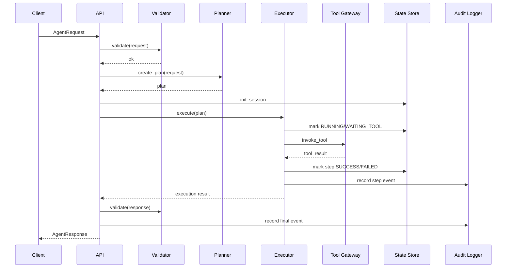

# Main Flow Sequence

## Request Path
1. API receives AgentRequest.
2. Validator checks request contract.
3. Planner builds ordered plan steps.
4. Executor runs tools via gateway.
5. State store persists step status and snapshots.
6. Response assembler returns AgentResponse.
7. Audit logger records final outcome.

## Mermaid

